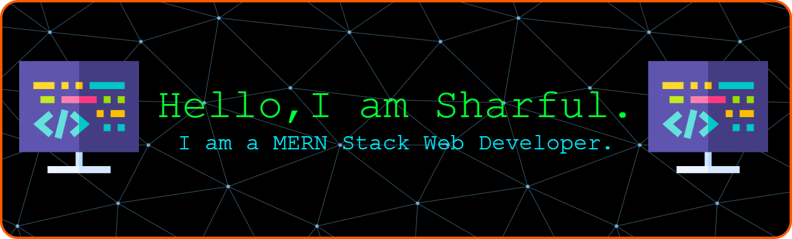
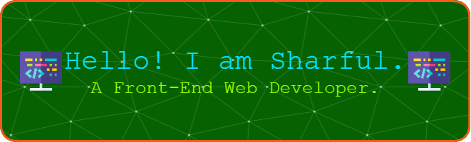

<!--  -->

# 👋 About Me
As a highly motivated, keen, and adaptable MERN Stack Web Developer with proven ability in building interactive web experiences using React, Firebase, Node.js, Express.js, MongoDB and modern tooling, I am seeking an opportunity to apply my skills, learn from experienced professionals, and contribute to innovative projects in a growth-oriented company.

# 💻 Skills
Front-End:          
Back-End:       
Database:    
Tools:      
# 🌱 Current Activities 
🎯 I am exploring Next.js.   
💻 I am working on a wellness website ([WellnessForge](https://wellness-forge-client.vercel.app/)).   
👯 Actively learning and building modern Full Stack MERN Projects.  
⚡ Exploring, adapting, and implementing the fast-changing tech in projects as required.

# 📊 GitHub Stats
 
 

---

# Connect with Me:
## [GitHub](https://github.com/ronnie012/)
## [LinkedIn](https://wwww.linkedin.com/in/md-sharful-islam)
## [Portfolio](https://ronnie012.github.io/sharful-012/)
<!-- 
##  Connect with Me
([https://facebook.com/Md Sharful Islam](https://www.facebook.com/profile.php?id=61571101114481))
-->
<!-- Proudly created with GPRM ( https://gprm.itsvg.in ) -->

<!--
**ronnie012/ronnie012** is a ✨ _special_ ✨ repository because its `README.md` (this file) appears on your GitHub profile.

Here are some ideas to get you started:

- 🔭 I’m currently working on ...
- 🌱 I’m currently learning ...
- 👯 I’m looking to collaborate on ...
- 🤔 I’m looking for help with ...
- 💬 Ask me about ...
- 📫 How to reach me: ...
- 😄 Pronouns: ...
- ⚡ Fun fact: ...
-->
